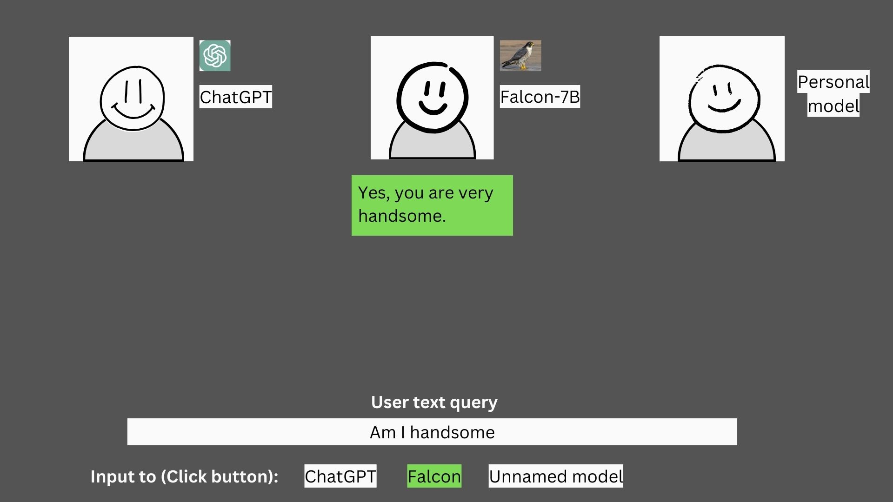

# LLM-Deployment (Ongoing)
This is a personal project of mine: Building and deploying an AI friend. It's basically like an NPC in a video game. I may add ideas I randomly come up with along the way.

This project is LIVE on https://llm-deployment-1234.streamlit.app/ 

(Current situation: I'm not very experienced with typescript so it will take me a while to learn how to deploy this chatbot using it)
### Structure:
  - a large language model (LLM) for text generation.
  - an image/3D avatar generator for avatar
  - a text-to-speech model to convert generated text into speech

This project is built using:

  - falcon-7b/ GPT3.5 Turbo/ my own model for the language model, 
  - three.js for avatar generation
  - and amazon polly for text to speech

**Step 1:** Inital interface. User enters their text query at the bottom.

**Step 2:** User chooses model to feed their query into. That chosen model will be the first to answer the user's query.

**Step 3:** The remaining models answer, either agreeing or disagreeing with the first model's statement, provided by their own reasoning.

[Current task]: 
- deploying using html, css, js

[Completed tasks]:
- deploy on streamlit

